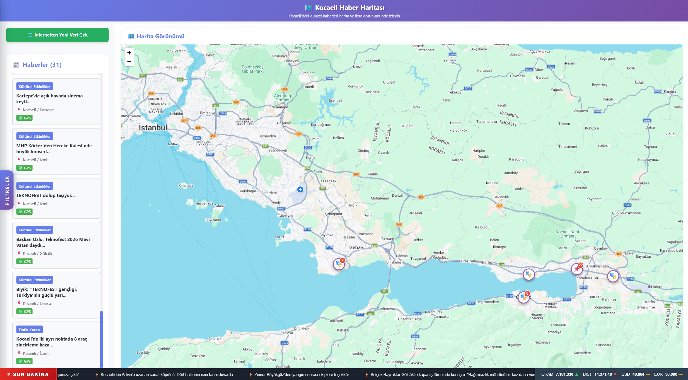

*Türkçe · [English](README.en.md)*

# Kocaeli Haber Haritası

Kocaeli'deki haber sitelerinden otomatik olarak haber çeken, bunları kategorilere ayıran, metinden konum tespit edip koordinata çeviren ve harita üzerinde gösteren tam yığın uygulama.

Kocaeli Üniversitesi Bilgisayar Mühendisliği, Yazılım Laboratuvarı II dersi birinci projesi.



## Nasıl çalışıyor

```
1. ScrapingService        →  jsoup ile haber sitelerinin HTML'i ayrıştırılır
2. ClassificationService  →  haber bir kategoriye yerleştirilir
3. LocationService        →  metinden Kocaeli ilçe / mahalle adı çıkarılır
4. GeocodingService       →  Google Maps API ile enlem-boylam bulunur
5. EmbeddingService       →  Google Gemini ile 768 boyutlu vektör üretilir
6. Kosinüs benzerliği     →  aynı haber başka sitede de varsa tespit edilir
7. MongoDB                →  yeni haber eklenir veya mevcut kayda kaynak eklenir
```

Aynı olayı birden fazla site yazdığında haber tekrarlanmaz; tek kayıt altında birden fazla kaynak listelenir.

## Gereksinimler

- Java 17+
- Node.js 18+
- MongoDB
- Google Maps API anahtarı (Geocoding API açık olmalı)
- Google Gemini API anahtarı

## Kurulum

### 1. Ortam değişkenleri

Proje kökündeki `.env.example` dosyasını `.env` olarak kopyala ve kendi anahtarlarınla doldur:

```
MONGODB_URI=mongodb://localhost:27017/kentsel_haber_db
GEMINI_API_KEY=buraya-gemini-anahtarini-yaz
GOOGLE_MAPS_API_KEY=buraya-maps-anahtarini-yaz
```

`application.properties` bu değerleri ortam değişkeni olarak okur, dosyada anahtar tutulmaz.

**Önemli:** Spring Boot `.env` dosyasını kendiliğinden okumaz. Değerleri çalıştırma ortamına tanıtman gerekir:

IntelliJ IDEA'da `Run > Edit Configurations > Proje1Application > Environment variables` alanına noktalı virgülle ayırarak yapıştır.

Terminalden çalıştırıyorsan (PowerShell):

```powershell
$env:MONGODB_URI="mongodb://localhost:27017/kentsel_haber_db"
$env:GEMINI_API_KEY="..."
$env:GOOGLE_MAPS_API_KEY="..."
```

Aynı işlemi frontend için de yap: `frontend/.env.example` dosyasını `frontend/.env` olarak kopyala. Vite bu dosyayı kendiliğinden okur, ek ayar gerekmez.

### 2. Backend

```bash
./mvnw spring-boot:run          # Linux / macOS
.\mvnw.cmd spring-boot:run      # Windows
```

Uygulama açılışta veri çekmeye başlar ve konsola ilerlemeyi yazar:

```
[YENİ KAYIT]
 ├─ Tür   : Trafik Kazası
 ├─ Konum : Kocaeli / Gölcük / Tepe Mahallesi
 ├─ GPS   : (40.7746943, 30.0026651)
 └─ Kaynak: Bizim Yaka Kocaeli
```

### 3. Frontend

```bash
cd frontend
npm install
npm run dev
```

## Proje yapısı

```
proje_1/
├── pom.xml
├── .env.example
│
├── src/main/java/tr/edu/kocaeli/proje_1/
│   ├── Proje1Application.java
│   ├── config/
│   │   └── CorsConfig.java              CORS ayarları
│   ├── controller/
│   │   ├── HaberController.java         haber uç noktaları
│   │   ├── ScrapingController.java      tarama tetikleme
│   │   └── FinansController.java        finans verileri
│   ├── service/
│   │   ├── ScrapingService.java         jsoup ile HTML ayrıştırma
│   │   ├── ClassificationService.java   kategori belirleme
│   │   ├── LocationService.java         metinden konum çıkarma
│   │   ├── GeocodingService.java        koordinat bulma
│   │   ├── EmbeddingService.java        vektör üretme
│   │   └── FinansService.java
│   ├── model/
│   │   ├── Haber.java
│   │   └── FinansVerisi.java
│   └── repository/
│       ├── HaberRepository.java
│       └── FinansRepository.java
│
└── frontend/
    ├── .env.example
    └── src/
        ├── App.jsx                      bileşenleri birleştirir
        ├── App.css
        │
        ├── api/                         tüm HTTP çağrıları
        │   ├── client.js                axios örneği, taban adres
        │   ├── haberService.js
        │   └── finansService.js
        │
        ├── constants/
        │   └── haberTurleri.js          tür, emoji ve renk tanımları
        │
        ├── utils/                       saf yardımcı fonksiyonlar
        │   ├── leafletSetup.js
        │   ├── haberGruplama.js         aynı koordinattaki haberleri toplar
        │   ├── finansFormat.js
        │   └── tarihFiltre.js
        │
        ├── hooks/                       durum ve yan etki mantığı
        │   ├── useHaberler.js           haber yükleme ve tarama
        │   ├── useHaberFiltre.js        tür, arama, konum, tarih filtresi
        │   ├── useFinans.js             periyodik finans güncellemesi
        │   ├── useDialog.js
        │   ├── useHaritaOdakla.js       seçilen habere uçma
        │   └── useSmartPinClick.js      harita pini tıklamaları
        │
        └── components/
            ├── layout/AppHeader.jsx
            ├── ortak/                   BildirimDialog, VeriCekButonu
            ├── filtre/                  FiltrePaneli + filtre.css
            ├── haber/                   HaberKarti, HaberListesi, HaberDetay
            ├── harita/                  HaritaGorunumu, KonumPopup, smartMarker
            └── serit/                   SonDakikaSeridi, FinansKutusu + serit.css
```

Frontend'de sorumluluklar katmanlara ayrılmıştır: `api` sunucuyla konuşur, `hooks` durumu yönetir, `components` yalnızca çizim yapar. Bir bileşen doğrudan HTTP çağrısı yapmaz.

## Arayüz

**Harita.** Aynı koordinattaki haberler tek pinde toplanır. Grup tek türden oluşuyorsa o türün ikonu, birden fazla tür varsa karma pin gösterilir; üzerine gelindiğinde türler yelpaze şeklinde açılır ve her dalda o türden kaç haber olduğu yazar.

**Kenar çubuğu.** Filtrelenmiş haber listesi. Bir habere tıklandığında harita o koordinata uçar ve altta detay paneli açılır.

**Filtreler.** Sol kenardan açılan çekmecede tür, konum, serbest metin araması ve tarih filtresi bulunur.

**Alt şerit.** Kayan son dakika başlıkları ve canlı finans göstergeleri. Şeridin üzerine gelince akış durur.

## API uç noktaları

| Yöntem | Yol | Açıklama |
|---|---|---|
| GET | `/api/haberler` | Tüm haberler |
| GET | `/api/haberler/{id}` | Tek haber |
| GET | `/api/haberler/turu/{turu}` | Türe göre filtre |
| GET | `/api/haberler/harita/konumlu` | Yalnızca koordinatı olanlar |
| GET | `/api/haberler/istatistik` | Sayısal özet |
| GET | `/api/scraping/cagdas` | Yeniden tarama başlatır |
| GET | `/api/finans` | Gram altın, BIST, USD, EUR |

## Veri modeli

```javascript
{
  "_id": "ObjectId",
  "haberTuru": "Trafik Kazası",
  "baslik": "İzmit'te trafik kazası...",
  "icerik": "...",
  "konumMetni": "Kocaeli / İzmit / Yeşilbahçe Mahallesi",
  "enlem": 40.7746943,
  "boylam": 30.0026651,
  "yayinTarihi": "2026-03-30T10:30:00",
  "embedding": [0.123, 0.456, "..."],
  "kaynaklar": [
    { "siteAdi": "Özgür Kocaeli",  "url": "https://..." },
    { "siteAdi": "Çağdaş Kocaeli", "url": "https://..." }
  ]
}
```

## Teknolojiler

Spring Boot, MongoDB, jsoup, Google Maps Geocoding API, Google Gemini API, Maven

React, Vite, Leaflet, react-leaflet, Axios

## Sorun giderme

**`Could not resolve placeholder 'MONGODB_URI'`** — Ortam değişkenleri tanımlanmamış. Yukarıdaki kurulum adımına bak.

**Harita boş, haber gelmiyor** — Backend çalışıyor mu (`localhost:8080`), tarayıcı konsolunda CORS hatası var mı, `frontend/.env` içindeki `VITE_API_URL` doğru mu kontrol et.

**Geocoding `REQUEST_DENIED`** — Google Cloud Console'da Geocoding API etkin değil ya da anahtar kısıtlaması engelliyor.

**MongoDB bağlantı hatası** — MongoDB servisi çalışıyor mu ve bağlantı adresi doğru mu kontrol et.

## Not

Bu proje eğitim amaçlı geliştirilmiştir. Haber içerikleri ilgili haber sitelerine aittir ve uygulama içinde kaynak bağlantılarıyla birlikte gösterilir.
